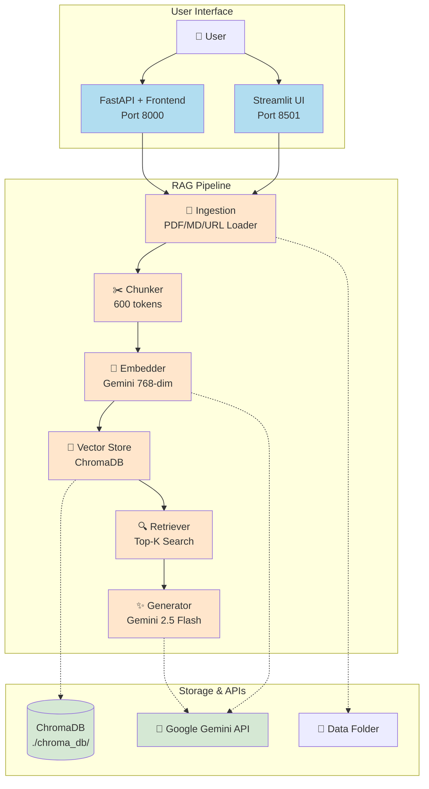
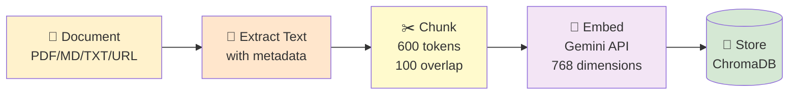

# 🧠 RAG Chatbot - Counsellor Expert

AI-powered document Q&A system. Upload documents, ask questions, get cited answers.

---

## ✨ Features

- 📄 **Multi-format**: PDF, Markdown, TXT, web URLs
- 🎨 **Dual UI**: Streamlit or FastAPI + Custom Frontend
- 🔍 **Smart Search**: Semantic search with ChromaDB
- 💬 **Memory**: Remembers last 10 conversation turns
- 📚 **Citations**: Every answer includes source references

---

## 🏗️ System Architecture



---

## 📊 Data Flow

### 1️⃣ Document Ingestion Flow



**Time**: ~5-10s for 10-page PDF

---

### 2️⃣ Query Processing Flow

```mermaid
flowchart TB
    A[💬 User Question] --> B[🔢 Embed Query<br/>Gemini API]
    B --> C[🔍 Search ChromaDB<br/>Cosine Similarity]
    C --> D[📄 Retrieve Top-K Chunks<br/>Default: 5]
    D --> E[📋 Build Context<br/>Query + Chunks + History]
    E --> F[✨ Generate Answer<br/>Gemini 2.5 Flash]
    F --> G[💬 Response with<br/>[N] Citations]

    H[💭 Conversation<br/>History] -.-> E

    style A fill:#cfe2f3
    style B fill:#fffacd
    style C fill:#f3e5f5
    style D fill:#fff4e6
    style E fill:#fff4e6
    style F fill:#e8f5e9
    style G fill:#cfe2f3
    style H fill:#e1d5e7
```

**Time**: ~3-4s per query

---

## 🚀 Quick Start

### 1. Install Dependencies

```bash
pip install -r requirements.txt
```

### 2. Configure API Key

Create/edit `.env`:
```env
GOOGLE_API_KEY=your_api_key_here
```

🔑 Get free key: [Google AI Studio](https://aistudio.google.com)

### 3. Run Application

**Option A: Streamlit** (Beginner-friendly)
```bash
streamlit run app.py
```
→ Open http://localhost:8501

**Option B: FastAPI** (Production-ready)
```bash
uvicorn server:app --reload --port 8000
```
→ Open http://localhost:8000

### 4. Use It

1. 📤 Upload documents (sidebar/UI)
2. ⏳ Wait for indexing (~5-10s)
3. 💬 Ask questions
4. 📚 Get answers with citations

---

## 📁 Project Structure

```
RAG_Drive/
├── app.py                 # Streamlit UI
├── server.py             # FastAPI backend
├── requirements.txt      # Dependencies
├── .env                  # API keys (SECRET)
│
├── rag/                  # Core modules
│   ├── ingestion.py      # Load PDF/MD/URL
│   ├── chunker.py        # Split text (tiktoken)
│   ├── embedder.py       # Gemini embeddings
│   ├── vectorstore.py    # ChromaDB operations
│   ├── retriever.py      # Semantic search
│   └── generator.py      # Answer generation
│
├── static/               # Frontend (FastAPI)
│   ├── index.html
│   ├── app.js
│   └── style.css
│
├── data/                 # Place documents here
└── chroma_db/           # Vector database
```

---

## 🛠️ Technology Stack

| Component | Technology |
|-----------|-----------|
| **Backend** | Python 3.11+, FastAPI, Streamlit |
| **Vector DB** | ChromaDB (local, persistent) |
| **Embeddings** | Google Gemini (768-dim) |
| **LLM** | Google Gemini 2.5 Flash |
| **PDF Parser** | PyMuPDF + pypdf |
| **Chunking** | tiktoken (cl100k_base) |

---

## 🌐 API Reference (FastAPI)

| Endpoint | Method | Description |
|----------|--------|-------------|
| `/api/status` | GET | Get chunk count |
| `/api/chat` | POST | Send message, get answer |
| `/api/ingest/file` | POST | Upload file |
| `/api/ingest/url` | POST | Ingest URL |
| `/api/clear` | POST | Clear all data |

**Example**:
```bash
curl -X POST http://localhost:8000/api/chat \
  -H "Content-Type: application/json" \
  -d '{"message": "What is counselling?", "top_k": 5}'
```

---

## ⚙️ Configuration

### Environment Variables
```env
GOOGLE_API_KEY=required              # Get from aistudio.google.com
GEMINI_MODEL=gemini-2.5-flash       # Optional: gemini-2.5-pro
```

### Adjust Chunking
Edit `rag/chunker.py`:
```python
CHUNK_SIZE = 600        # tokens per chunk
CHUNK_OVERLAP = 100     # overlap between chunks
```

### Retrieval Settings
- **Top-K**: 1-10 (adjustable in UI)
- **Recommended**: 5 for balance, 3 for speed

---

## ⚡ Performance

| Operation | Time |
|-----------|------|
| PDF Ingestion (10 pages) | ~5-10s |
| Query Processing | ~3-4s |
| Vector Search | ~0.5s |
| Answer Generation | ~2-3s |

**Capacity**: Unlimited documents (disk-limited), millions of chunks

---

## 🐛 Troubleshooting

| Issue | Solution |
|-------|----------|
| `GOOGLE_API_KEY not set` | Add key to `.env` file |
| `RESOURCE_EXHAUSTED` / `429` | Wait 24h or use `gemini-2.5-pro` |
| ChromaDB lock error | Close other instances |
| Port already in use | Change port: `--port 8001` |

---

## 🚀 Deployment

### ⚠️ Important: Local Storage Limitation

This app uses **local ChromaDB** (`./chroma_db/`) which requires **persistent disk storage**.

### ✅ Compatible Platforms

| Platform | Cost | Persistent Storage | Notes |
|----------|------|-------------------|-------|
| **Hugging Face Spaces** | FREE | ✅ Yes | ⭐ **Best free option** |
| Fly.io | FREE | ✅ Yes (3GB) | Excellent choice |
| Render | $7/mo | ✅ Yes | Production-ready |
| Railway | ~$5 trial | ✅ Yes | Good for testing |

### ❌ NOT Compatible

- **Render Free Tier** - Ephemeral storage (data lost on restart)
- **Vercel** - Serverless (no local storage)
- **Netlify** - Serverless (no local storage)

### 🔄 For Serverless Deployment

Replace ChromaDB with cloud vector database:
- Pinecone (1M vectors free)
- Weaviate Cloud (free tier)
- Supabase + pgvector (free tier)

---

## 🔒 Security

- ⚠️ Never commit `.env` file
- ✅ `.gitignore` already configured
- 🔐 No authentication (single-user design)
- 📝 File upload validated by extension

---

## 📄 License

Open source for educational and commercial use.

---

## 🙋 Support

- 📖 Check Troubleshooting section above
- 🔧 Review [Google Gemini API Docs](https://ai.google.dev/)
- 🗄️ Review [ChromaDB Docs](https://docs.trychroma.com/)

---

**Built with** ❤️ using Google Gemini + ChromaDB + Python
